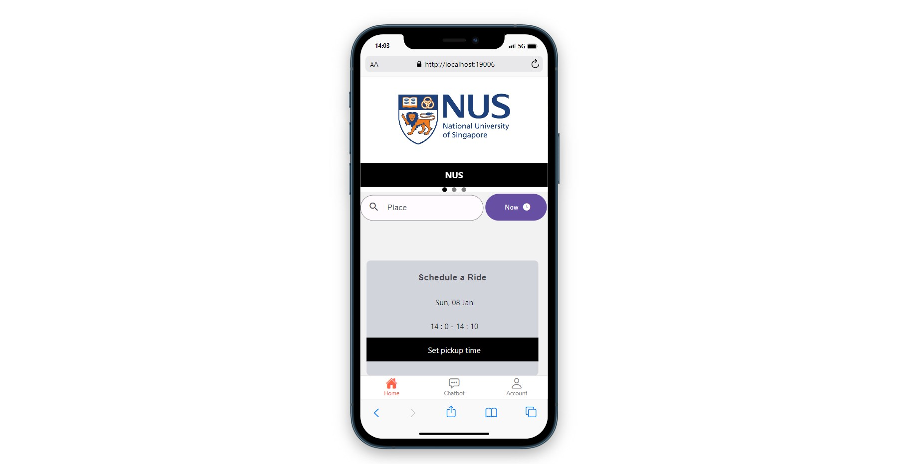
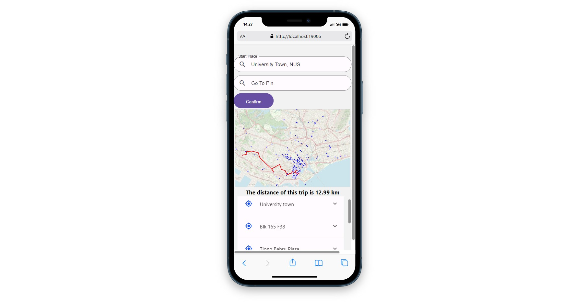
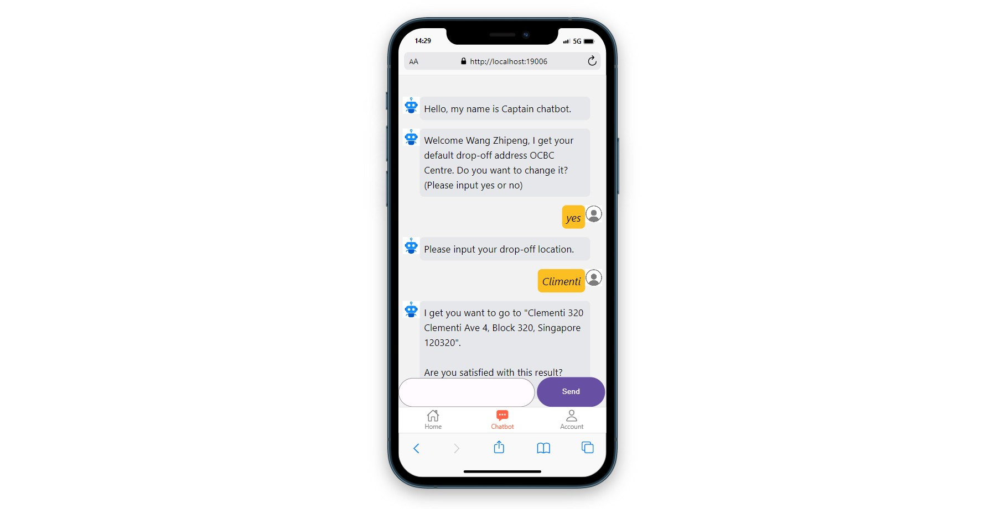

# ~~NewUber~~Cyber Share

## Introduction

**This project helped students in NUS to share the taxi. Students can register an account.**

**And then, Students can select the destination, the app automatically helps students find carpoolers.**

**Student also can refer to robot for help.**

## Install

### Frontend

download [Node.js](https://nodejs.org/en/download/)
`$ npm install`

### Backend

download [python3.6](https://www.python.org/downloads/release/python-360/)
`$ pip install -r requirements.txt`

### Error and Solution

In file:.\lib\site-packages\chatterbot\tagging.py
**Change** `yaml.load()` **to** `yaml.safe_load() `

**Change** `self.nlp = spacy.load(self.language.ISO_639_1.lower())` **to**
`if self.language.ISO_639_1.lower() == 'en': self.nlp = spacy.load('en_core_web_sm')  `
`else: self.nlp = spacy.load(self.language.ISO_639_1.lower())`

## Detailed Introduction

This is my first time to build an application by React-Native. Emmm, honestly it's a pain to use. React-Native should have more components to support the framework.

This project use the K-means algorithm to cluster more than 400 stations in Singapore. According to the clustering results, the passengers on the way are planned together, the taxis are shared, and the route is planned using the Dijkstra algorithm. 

There are also a chatbots to answer customers questions, trained using the Bert pre-trained model, If you want to know more about the details of this Neural Networks, you can refer to this paper:

[BERT: Pre-training of Deep Bidirectional Transformers for Language Understanding](https://arxiv.org/abs/1810.04805)
